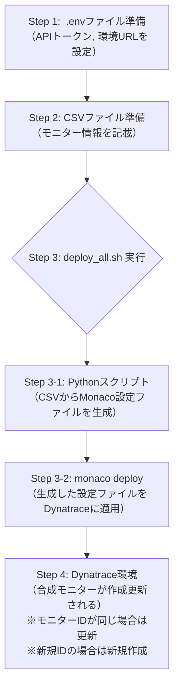

# Dynatrace合成モニター一括登録手順 (CSV利用)

このドキュメントは、CSVファイルに定義された情報に基づいて、Dynatrace環境に合成ブラウザモニターを一括で登録・更新するための手順を説明します。
このプロセスでは、Pythonスクリプト、自動実行用シェルスクリプト、およびDynatrace Configuration as CodeツールであるMonaco (v2) を使用します。

## 処理フロー概要

処理の全体像は以下の通りです。



1.  **`.env` ファイルの準備**: DynatraceのAPIトークンと環境URLを記述した `.env` ファイルをプロジェクトルートに配置します（初回のみ）。
2.  **CSVファイルの準備**: 登録・更新したい合成モニターの情報をCSVファイル (`vars/monitors.csv`) に記述します。
3.  **`deploy_all.sh` の実行**: 提供されているシェルスクリプト (`deploy_all.sh`) を実行します。
    *   内部でPythonスクリプト (`csv_to_individual_configs.py`) が実行され、CSVからMonaco設定ファイル群が自動生成されます：
        - `projects/synthetic-monitor/project.yaml`: プロジェクトの基本設定
            - モニター名、説明文
            - モニタータイプ（ブラウザ）
            - スクリプトタイプ（availability/clickpath）
            - 実行頻度、有効/無効状態
        - `projects/synthetic-monitor/monitor.json`: 各モニターの詳細設定
            - モニターID、名前、説明
            - 対象URL、実行ロケーション
            - デバイス設定（デバイス名、ネットワークタイプ）
            - タグ設定（Purpose, Industry, Owner, ExpiryDate, カスタムタグ）
            - 異常検知設定（デフォルト値使用）
    *   続いて `monaco deploy` コマンドが実行され、生成された設定がDynatrace環境にデプロイ（作成または更新）されます。

## 前提条件

*   Monaco CLI (v2.23.1以降推奨）がインストールされていること。
*   Python (3.x) がインストールされていること (必要なライブラリ: `PyYAML` ※Monacoが内部で使用、`csv` は標準ライブラリ）。
*   **`.env` ファイルの準備**: プロジェクトのルートディレクトリに `.env` という名前のファイルを作成し、DynatraceのAPIトークンと環境URLを設定済みであること。例:
    ```
    DT_API_TOKEN=dt0c01.YOUR_API_TOKEN
    DT_ENV_URL=https://your-environment.live.dynatrace.com
    ```
    または、`environments.yaml` で定義した環境名に合わせて設定 (例: 環境名 `prod` の場合）。
    ```
    MONACO_TOKEN_PROD=dt0c01.YOUR_API_TOKEN
    MONACO_ENVIRONMENT_URL_PROD=https://your-environment.live.dynatrace.com
    ```
    **注意:** `.env` ファイルは `.gitignore` に追加し、リポジトリにコミットしないようにしてください。
*   **シェルスクリプトの準備**: `deploy_all.sh` がプロジェクトのルートディレクトリに存在し、実行権限が付与されていること (`chmod +x deploy_all.sh`)。
*   `manifest.yaml` ファイルが適切に設定されていること（とくにプロジェクトパスと環境情報）。
*   Pythonスクリプト (`csv_to_individual_configs.py`) とCSVファイル (`vars/monitors.csv`) が所定のパスに配置されていること。

## 手順詳細

### 1. `.env` ファイルの準備 (初回のみ)
プロジェクトのルートディレクトリに `.env` ファイルを作成し、Dynatrace APIトークンと環境URLを記述します。
(詳細は「前提条件」セクションを参照）

### 2. CSVファイルの準備
以下の列を持つCSVファイル (`vars/monitors.csv`) を作成または編集します。エンコーディングはUTF-8 (BOM付き推奨）です。

| 列ヘッダー           | 説明                                                                      | データ型 (例)         | 備考                                                                                                |
| -------------------- | ------------------------------------------------------------------------- | --------------------- | --------------------------------------------------------------------------------------------------- |
| `monitor_id`         | モニターの一意なID (ファイル名やMonacoの設定IDに使用)                       | 文字列                | 英数字とハイフン推奨。必須。                                                                           |
| `monitor_name`       | Dynatrace上に表示されるモニター名                                         | 文字列                | 省略時は "Unnamed Monitor"                                                                            |
| `target_url`         | モニター対象のURL                                                           | 文字列 (URL)          | 省略時は "https://www.dynatrace.com"                                                                  |
| `description`        | スクリプトイベントの説明文                                                    | 文字列                | 省略時は "Navigate to [target_url]"                                                                 |
| `frequencyMin`       | 実行頻度 (分)                                                             | 数値                  | 例: `5`, `15`, `30`, `60`。省略時または無効値の場合は `60`。                                             |
| `enabled`            | モニターを有効にするか                                                      | 真偽値 (`true`/`false`) | 省略時は `true`。                                                                                    |
| `location_id`        | 実行ロケーションID。複数指定する場合はセミコロン (`;`) で区切る。           | 文字列                | 例: `GEOLOCATION-XXX1`;`GEOLOCATION-YYY2`。省略時はスクリプト内のデフォルト値。                       |
| `device_name`        | デバイス名 (例: `Desktop`, `iPhone X`, `Galaxy S9`)                         | 文字列                | 省略時は `Desktop`                                                                                   |
| `network_type`       | ネットワークタイプ (例: `WiFi`, `MobileSlow3G`, `MobileRegular`)            | 文字列                | 省略時は `WiFi`                                                                                      |
| `script_type`        | スクリプトの種類 (`availability` または `clickpath`)                        | 文字列                | 省略時は `availability`。`clickpath` の場合、`monitor.json` のイベント詳細設定は手動調整が必要な場合あり。 |
| `tag_purpose`        | タグ: Purpose                                                               | 文字列                | 必須タグ。値が設定されていれば `Purpose:[値]` として付与。                                                  |
| `tag_industry`       | タグ: Industry                                                              | 文字列                | 必須タグ。値が設定されていれば `Industry:[値]` として付与。                                                 |
| `tag_owner`          | タグ: Owner                                                                 | 文字列                | 必須タグ。値が設定されていれば `Owner:[値]` として付与。                                                    |
| `tag_expiry_date`    | タグ: ExpiryDate                                                            | 文字列                | 必須タグ。値が設定されていれば `ExpiryDate:[値]` として付与。                                               |
| `tag_custom`         | 汎用タグ。キー:値 のペアをセミコロン (`;`) で区切る。値なしの場合はキーのみ。 | 文字列                | 例: `team:alpha;status:prod` や `important-flag`。                                                     |

*   異常検知設定 (`anomalyDetection`) は現在CSVから直接設定していません。`monitor.json` 内で固定のデフォルト値が使用されます。カスタマイズが必要な場合は生成後の `monitor.json` を直接編集するか、Pythonスクリプトを修正してください。

### 3. シェルスクリプトの実行 (`deploy_all.sh`)

ターミナルで以下のコマンドを実行し、CSVファイルからの設定生成とDynatraceへのデプロイを一度に行います。スクリプトはワークスペースのルートディレクトリから実行することを想定しています。

```bash
./deploy_all.sh
```

*   スクリプトは内部で以下の処理を実行します：
    1. `vars/monitors.csv` を読み込み、各モニターの設定情報を解析
    2. `projects/synthetic-monitor/` 配下に各モニター用の設定ファイルを生成
        - `monitor.json`: モニターの主要設定（URL、頻度、タグなど）
        - `anomalyDetection.json`: 異常検知の設定
        - その他必要な設定ファイル
    3. 生成したファイルの構文チェックを実行

*   設定ファイル生成後、Monacoが以下の手順でデプロイを実行：
    1. `manifest.yaml` から環境情報とプロジェクト構成を読み込み
    2. `.env` ファイル（または環境変数）からAPI認証情報を取得
    3. 指定された環境（`environments.yaml` の `prod` など）に対して設定をデプロイ
    4. デプロイ結果をログファイル（`.logs/` ディレクトリ）に出力

*   デプロイ時の動作：
    - 新規モニター：そのまま作成
    - 既存モニター：設定を更新（モニターIDで一致判定）
    - 削除されたモニター：そのまま残存（自動削除はされない）

## トラブルシューティング

*   **`.env` ファイル未設定/読み込みエラー**: `deploy_all.sh` 実行時にAPIトークンや環境URLが見つからない旨のエラーが出た場合は、`.env` ファイルが正しく作成・配置されているか、内容が正しいか確認してください。
*   **`deploy_all.sh` 実行権限エラー**: `Permission denied` と表示された場合は、`chmod +x deploy_all.sh` コマンドで実行権限を付与してください。
*   **Monacoのバージョン**: Monaco v2の構文はv1と異なります。v2.23.1以降の使用を推奨します。
*   **APIトークンの権限**: `Token is missing required scope` というエラーが出た場合は、APIトークンに必要な権限が付与されているか確認してください。
*   **ファイルパス**: `project.yaml` 内の `config.template` や `manifest.yaml` 内の `path` が正しいか確認してください。
*   **JSONの構文**: `monitor.json` が正しいJSON形式であるか確認してください。Pythonスクリプトが生成するJSONが不正な場合、Monacoがエラーを出力します。
*   **ロケーションID**: `BROWSER Monitors can not be executed on public location(s)` というエラーは、ブラウザモニターにパブリックロケーションが指定されている場合に発生します。プライベートロケーションIDを使用してください。
*   **Monacoのログ**: デプロイ時にエラーが発生した場合は、Monacoが出力するログ (`.logs/` ディレクトリ内）を確認することで、原因究明の手がかりが得られます。
*   **CSVのエンコーディング**: CSVファイルが正しく読み込めない場合、エンコーディング（UTF-8 BOM付き推奨）を確認してください。

## 補足

*   このアプローチでは、各モニターの設定が個別のファイル群として管理されるため、Monacoの複雑なテンプレート機能やパラメーター置換に起因する問題を回避しやすくなります。
*   CSVファイルとPythonスクリプトを修正することで、生成される `monitor.json` の内容を柔軟に変更可能です。たとえば、より複雑なスクリプトイベントの定義や、異常検知ルールの詳細設定などもCSVから制御できるよう拡張できます。
